# designED

Welcome to Readme.md of DesignED team!

# Theme installation

First, follow the document below.

[WP Local setup](https://docs.google.com/document/d/1H8_SA2pxsIRQKkaT1ilrDuTKQj0Y7lXDFyYJ7AIcQlI/edit?tab=t.0)

- Find the location where to clone the theme. This will be where we clone and work on the theme.
  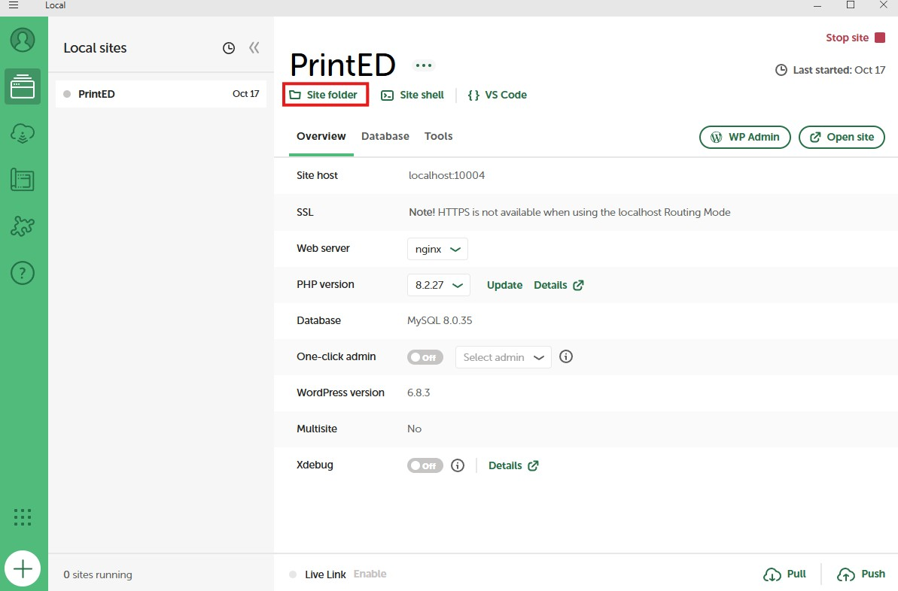
  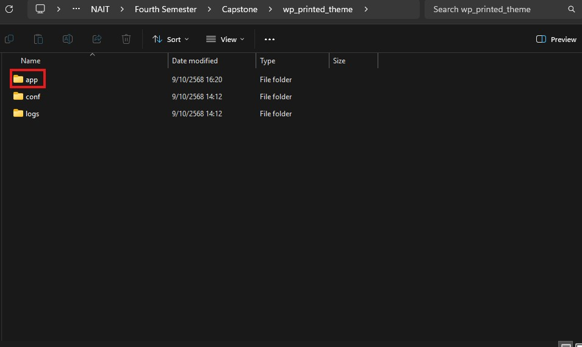
  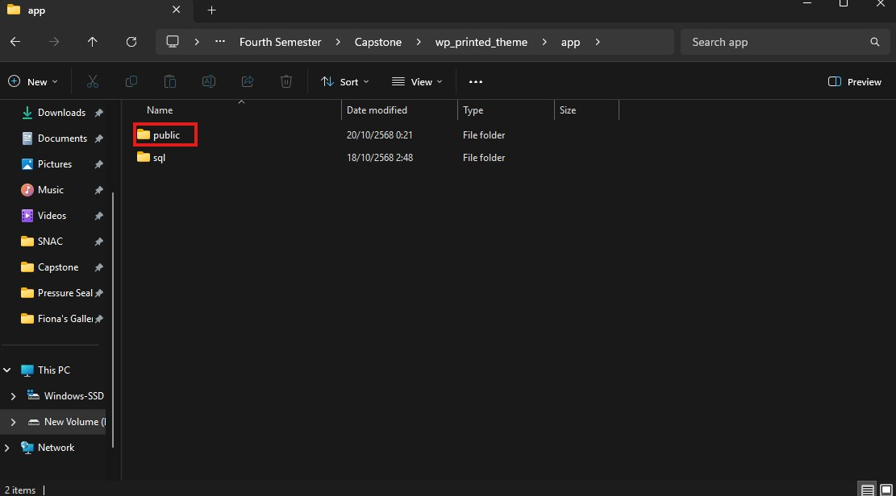
  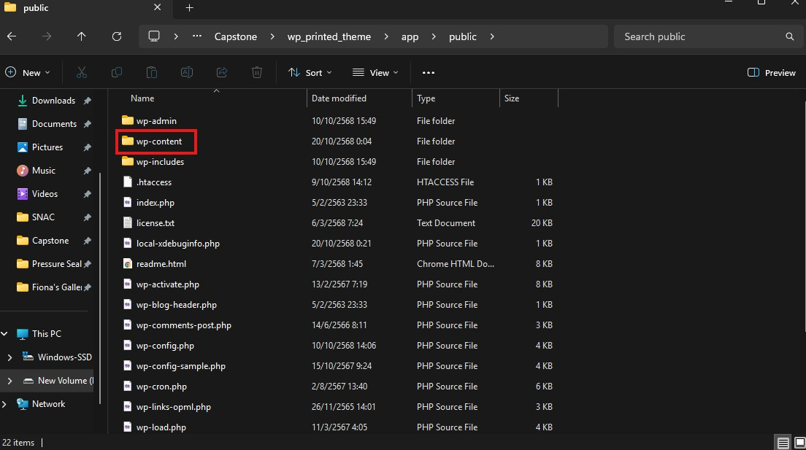
  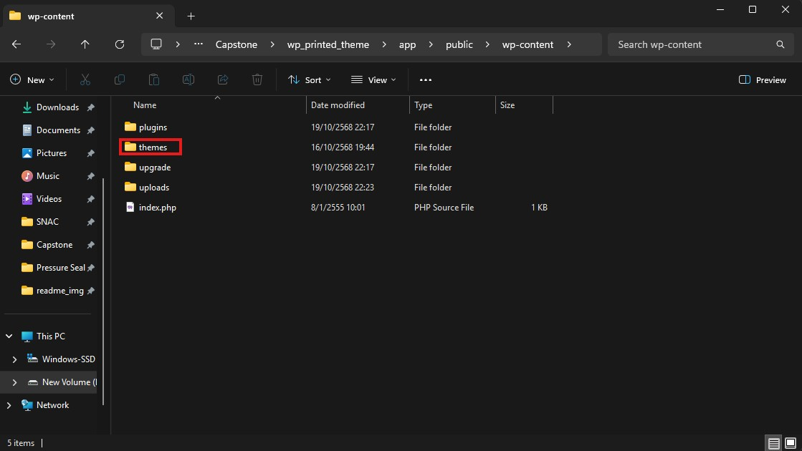
  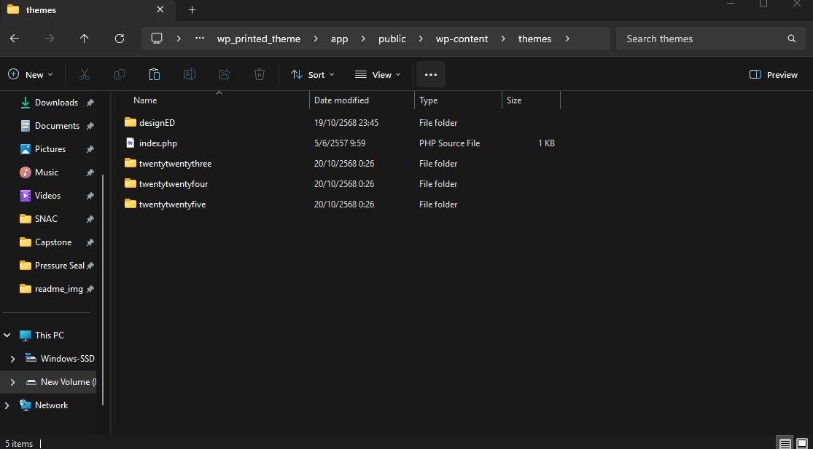

# How to clone the repo and work on your branch

<h3> 1. Using git cli</h3>

- If using window go to search bar at the bottom of your screen, type cmd and choose Command Prompt.  
  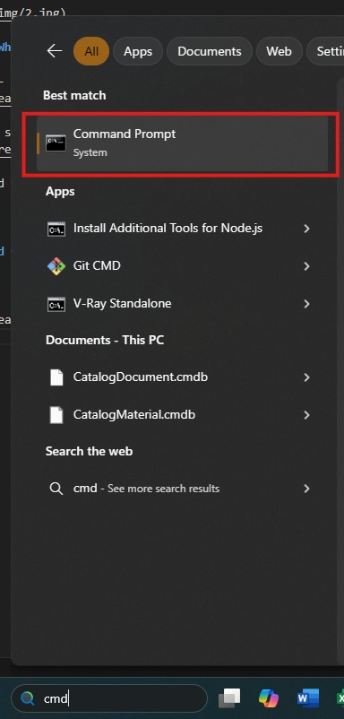
- type **cd** and find the location where you want to clone your repo (Picture below is just the example, your path should be different).  
  

> _If you find you path and want to make a new folder, type **mkdir yourfolder name**_   _to go back in directory, type **cd ..**_

- After finding the path that you want, go back to Github repo in the browser and look for HTTPS url like the image below.
  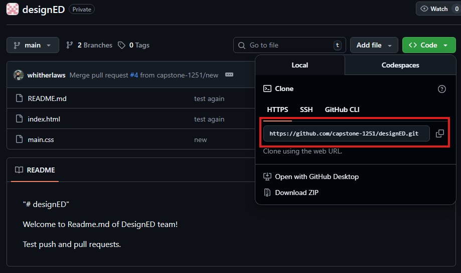

- Then type **`git clone https://github.com/capstone-1251/designED.git`** and hit enter.  
  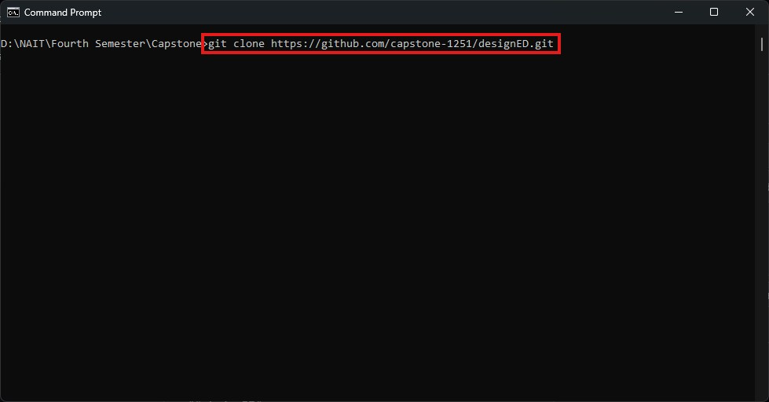

- After you've done with git clone, go to the git repo folder by typing **cd designed**.  
  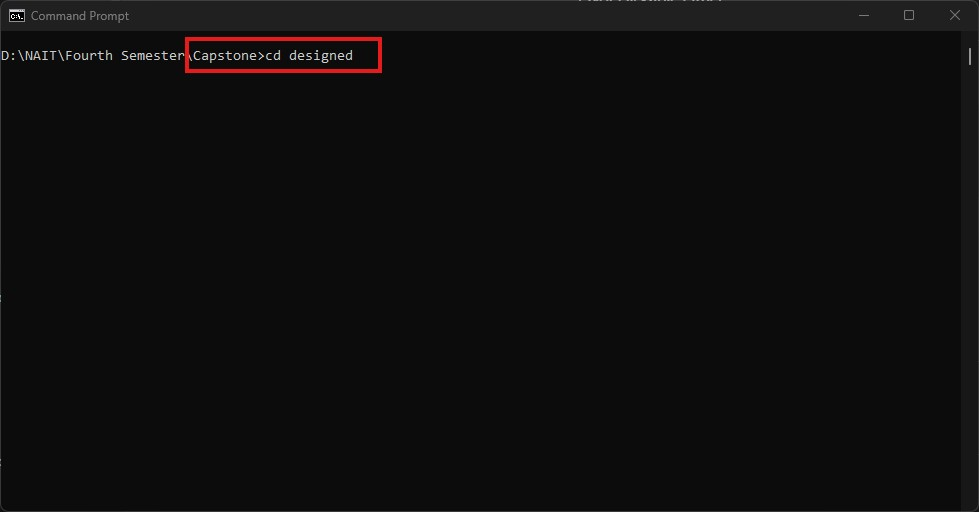

- Type **code .** to open visual studio code. Now you can work locally.  
  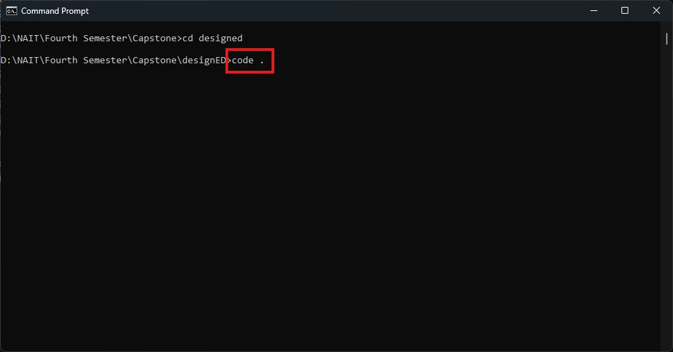

  <h3> 2. Using Github Desktop</h3>

- First, download Github Desktop [Download](https://github.com/apps/desktop)

- Go to the main branch of repo click the **Code** button and click Open with Github Desktop.  
  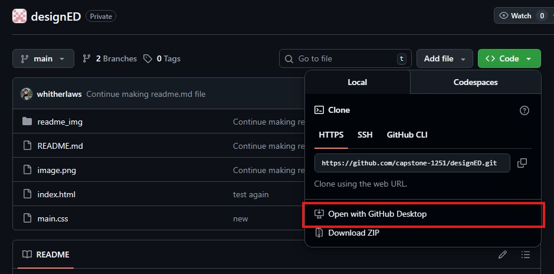

- Choose your desired local path.

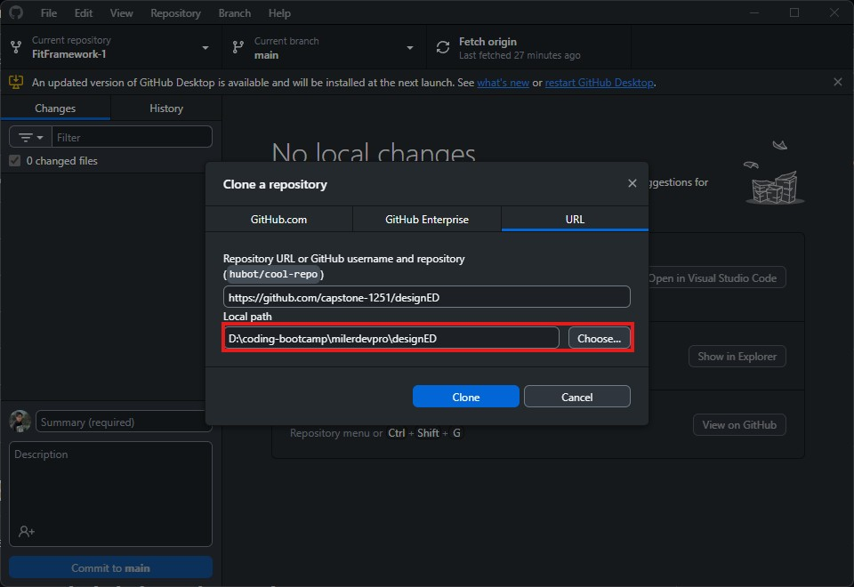

- Click Open Visual Studio Code and you can start working on there.

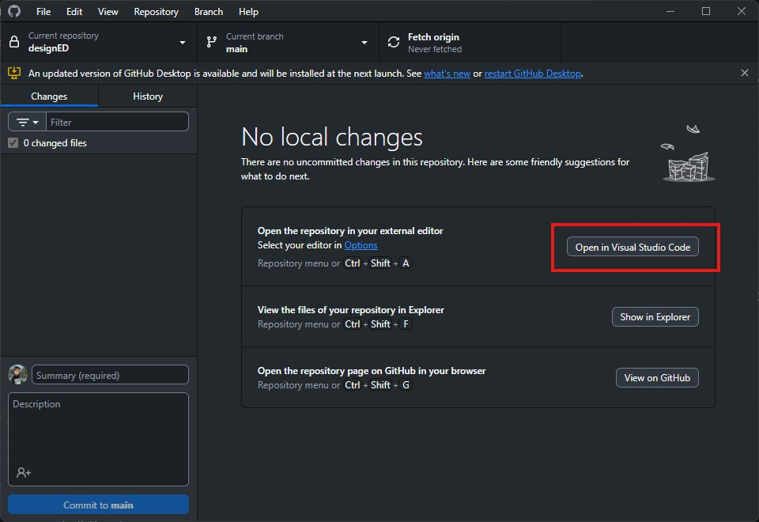

# Creating and deleting branches

1. On GitHub main page of the repository, click the main button and click view all branches.  
   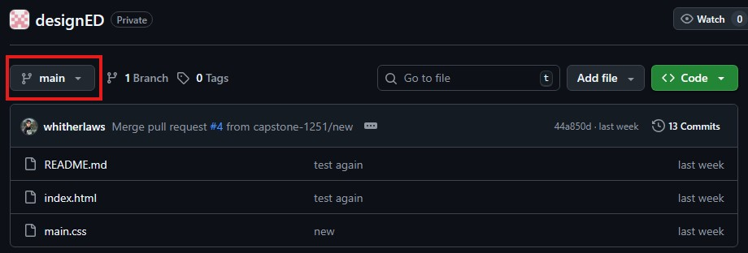

2. Click New branch.  
   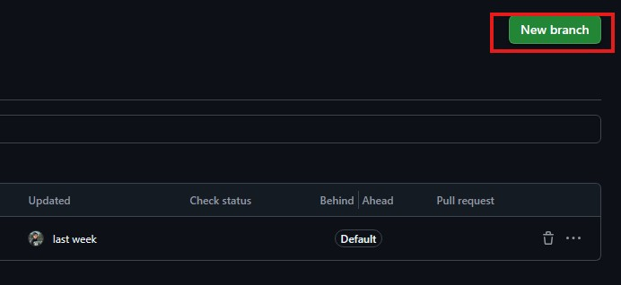

3. Create a new branch. **When you create a new branch** please use this name convention yourname-theme-number of your iteration (You can see the example on the image below)

- Under the branch source - Select main.  
  

4. The branch created will show up at your branches and active branches. Click your branch (either are fine like the image below).  
   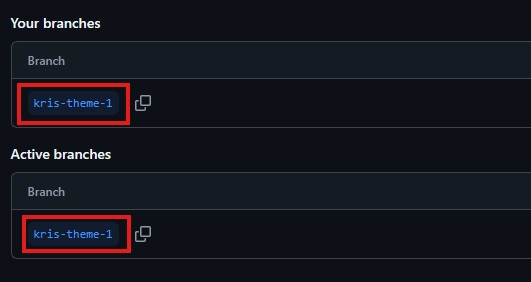

5. Clone the whole Repo and work on the branch you just created.
    
    

# Commit, Push and Pull request

<h3> 1. Commit and push Using git cli</h3>

- Open terminal in Visual Studio Code.

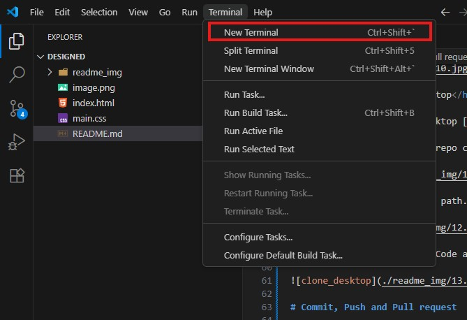

- type _**git add .**_

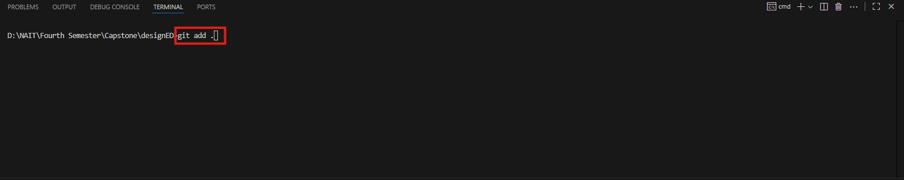

- type _**git commit -m "your comment"**_ to commit your code, in the double quotes, you can add the comment. The comment section should reflect on what you did.

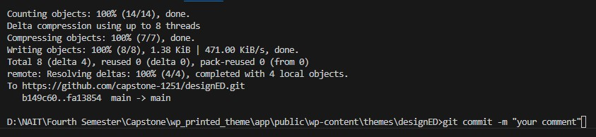

- type _**git push**_ to push you code to the main branch

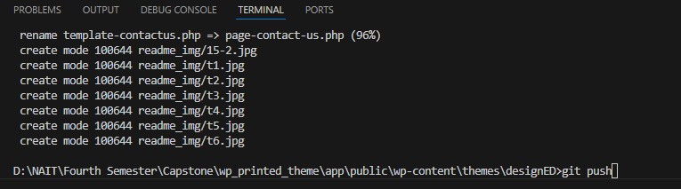

<h3> 2. Commit and push Using git cli</h3>
fdasdf
fdasasfd
sfda
